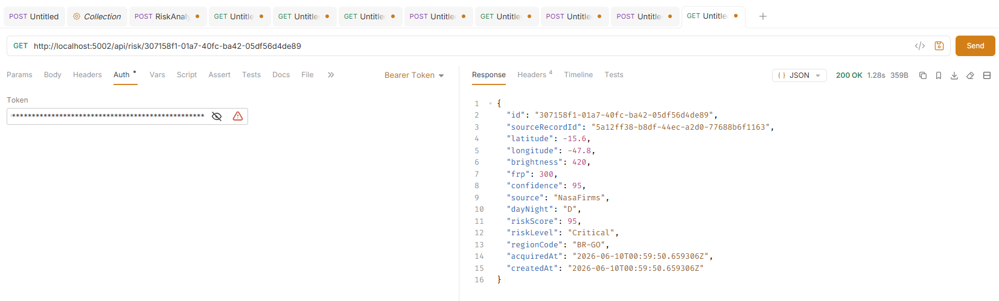
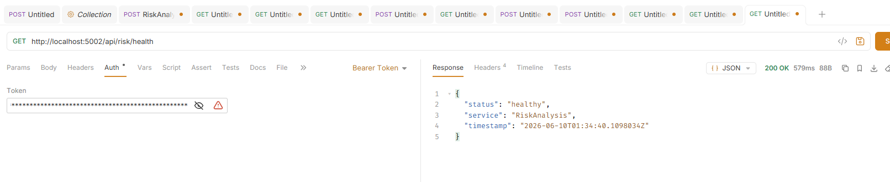

# FireWatch.Risk Analysis Service

Microsserviço ASP.NET 8 responsável por consumir eventos de dados espaciais do barramento RabbitMQ, calcular o score de risco de queimada por região geográfica e expor os resultados via API REST.

---

## Sumário

1. [Problema abordado](#1-problema-abordado)
2. [Objetivo do serviço](#2-objetivo-do-serviço)
3. [Arquitetura e posição na solução](#3-arquitetura-e-posição-na-solução)
4. [Estrutura do projeto](#4-estrutura-do-projeto)
5. [Componentes e responsabilidades](#5-componentes-e-responsabilidades)
6. [Algoritmo de scoring](#6-algoritmo-de-scoring)
7. [Fluxo principal da aplicação](#7-fluxo-principal-da-aplicação)
8. [Abstrações e contratos](#8-abstrações-e-contratos)
9. [Modelo de dados](#9-modelo-de-dados)
10. [Endpoints REST](#10-endpoints-rest)
11. [Tratamento de exceções](#11-tratamento-de-exceções)
12. [Validação de entrada](#12-validação-de-entrada)
13. [Configuração e dependências](#13-configuração-e-dependências)
14. [Como executar](#14-como-executar)

---

## 1. Problema abordado

Focos de calor detectados por satélites (NASA FIRMS) geram volumes massivos de dados brutos como coordenadas geográficas, brilho radiativo, FRP e índice de confiança. Por si só, esses dados não comunicam risco de forma acionável para gestores de defesa civil ou analistas ambientais.

O problema central é **transformar leituras brutas de sensores remotos em um score de risco quantificado por região**, de forma automatizada e em tempo próximo ao real, permitindo que sistemas downstream (alertas, e  mobile) reajam a situações críticas sem necessidade de análise manual.

---

## 2. Objetivo do serviço

O **Risk Analysis Service** tem responsabilidade única dentro da solução FireWatch: Receber eventos de dados espaciais via mensageria, aplicar um algoritmo de scoring ponderado sobre os atributos do foco de calor, persistir o resultado e manter um resumo atualizado de risco por região.

Adicionalmente, expõe uma API REST para consulta dos assessments históricos e para ingestão manual de registros .

---

Esse serviço é **puramente reativo**: não puxa dados ativamente. Toda ingestão ocorre via mensagem entregue pelo RabbitMQ. A única exceção é o endpoint `POST /api/risk/analyze`, que permite análise manual sob demanda.

---

## 4. Estrutura do projeto

```
FireWatch.RiskAnalysis/
│
├── Controllers/
│   └── RiskController.cs          # Endpoints REST (5 rotas)
│
├── Data/
│   ├── RiskDbContext.cs            # EF Core DbContext + mapeamento
│   └── RiskDbContextFactory.cs     # Factory para migrations CLI
│
├── DTO/
│   └── RiskAnalysisRequest.cs      # Records de request/response
│
├── Messaging/
│   ├── RabbitMQConsumer.cs         # BackgroundService: consumer AMQP
│   └── SpatialDataReceivedEvent.cs # Contrato do evento recebido
│
├── Middlaware/
│   └── GlobalExceptionMiddleware.cs # Intercepta exceções contendo tratamento personalizado para as principais
│
├── Models/
│   ├── RiskAssessment.cs           # Entidade principal e enum RiskLevel
│   └── RegionRiskSummary.cs        # Agregado de risco por região
│
├── Services/
│   ├── Interfaces/
│   │   └── IRiskService.cs         # Contrato da camada de serviço
│   └── RiskService.cs              # Lógica de negócio e scoring
│
├── Validators/
│   └── RiskAnalysisRequestValidator.cs  # FluentValidation para ManualRiskRequest
│
├── GlobalUsings.cs                 # Usings globais do projeto
├── Program.cs                      # Composição root: DI, middleware, EF
└── appsettings.json                # Configuração de conexões
```

---

## 5. Componentes e responsabilidades

### `RabbitMQConsumer` camada de entrada assíncrona

`BackgroundService` que é iniciado junto com a aplicação e mantém uma conexão persistente com o RabbitMQ.

Responsabilidades:
- Declarar o exchange `firewatch.events`  e a fila `firewatch.risk.analysis`
- Fazer o bind com routing key `firewatch.spatial.received`
- Configurar `prefetchCount: 1` para processamento sequencial e controle de pressão
- Deserializar o payload para `SpatialDataReceivedEvent`
- Delegar o processamento para `IRiskService.AssessAsync`
- Emitir `BasicAck` em caso de sucesso ou `BasicNack` com `requeue: true` em caso de exceção (garantia de reentrega)
- Reconectar automaticamente com retry em caso de falha de conexão (backoff de 5 segundos)

```
Mensagem chega
      │
      ▼
Deserializa JSON → SpatialDataReceivedEvent
      │
      ├── null? ──▶ BasicNack (requeue: false) mensagem descartada
      │
      ▼
Cria scope de DI → resolve IRiskService
      │
      ▼
AssessAsync(event)
      │
      ├── sucesso ──▶ BasicAck
      └── exceção  ──▶ BasicNack (requeue: true) + log de erro
```

### `RiskService` centro da regra de negócio

Implementa `IRiskService`. Recebe o evento, executa o algoritmo de scoring, persiste o resultado e atualiza o resumo da região.

Não possui dependências em infraestrutura de mensageria opera apenas sobre `RiskDbContext` e `ILogger`. Isso o torna facilmente testável de forma isolada.

### `RiskController` interface HTTP

Controller REST com 5 endpoints documentados via Swagger. Mapeia requests HTTP para chamadas ao `IRiskService`. Não contém lógica de negócio.

### `GlobalExceptionMiddleware` barreira de erro

Registrado no topo do pipeline, captura qualquer exceção não tratada e retorna uma resposta JSON padronizada com `errorCode: "INTERNAL_ERROR"`, evitando que stack traces vazem para o cliente.

### `ManualRiskRequestValidator` validação de entrada

Validador FluentValidation registrado via `AddFluentValidationAutoValidation()`. Valida bounds geográficos, ranges físicos dos atributos e o campo `DayNight`. Retorna `400 Bad Request` automaticamente antes de o controller ser invocado.

### `RiskDbContext` acesso a dados

DbContext EF Core com dois `DbSet`:
- `RiskAssessments` → tabela `risk_assessments`
- `RegionRiskSummaries` → tabela `region_risk_summaries`

Mapeamentos explícitos de precisão decimal, MaxLength de strings e índices compostos para as queries mais frequentes (`RegionCode`, `AcquiredAt`, `RiskLevel`).

---

## 6. Algoritmo de scoring

O score final é um número contínuo de **0 a 100**, resultado de uma combinação linear ponderada de quatro indicadores derivados dos dados brutos do satélite.

### Indicadores e pesos

| Indicador       | Fonte                | Peso  | Descrição                                              |
|-----------------|----------------------|-------|--------------------------------------------------------|
| `brightScore`   | `Brightness` (K)     | 30%   | Temperatura radiativa do pixel, normalizada entre 300 K e 420 K |
| `frpScore`      | `Frp` (MW)           | 35%   | Fire Radiative Power — energia liberada pelo fogo, normalizada entre 0 e 500 MW |
| `confScore`     | `Confidence` (0–100) | 20%   | Confiança do satélite na detecção do foco, usada diretamente |
| `densityScore`  | Contagem no banco    | 15%   | Número de focos na mesma região nas últimas 24 horas, normalizado para 50 focos como referência de saturação |

### Normalização

```
Normalize(value, min, max) = Clamp((value - min) / (max - min), 0.0, 1.0)
```

`brightScore` e `frpScore` são normalizados para [0, 1] e multiplicados por 100 antes de entrar na combinação.

`densityScore` é calculado como `Min(count / 50 * 100, 100)` — 50 focos em 24h representa saturação (100 pontos).

### Score final

```
score = brightScore × 0.30
      + frpScore    × 0.35
      + confScore   × 0.20
      + densityScore× 0.15

score = Clamp(score, 0, 100)
score = Round(score, 2)
```

### Classificação

| Score      | Nível      | Enum value |
|------------|------------|------------|
| 0 – 25     | `Low`      | 1          |
| 26 – 50    | `Medium`   | 2          |
| 51 – 75    | `High`     | 3          |
| 76 – 100   | `Critical` | 4          |

### Resolução de região

A região é inferida a partir das coordenadas via pattern matching sobre faixas de latitude/longitude para o território brasileiro:

| Código   | Estado              | Faixa lat / lon aproximada              |
|----------|---------------------|------------------------------------------|
| `BR-AM`  | Amazonas            | lat [-5, 5], lon [-73, -44]             |
| `BR-PA`  | Pará                | lat [-10, -5], lon [-73, -44]           |
| `BR-MT`  | Mato Grosso         | lat [-15, -10], lon [-60, -44]          |
| `BR-GO`  | Goiás               | lat [-20, -15], lon [-60, -40]          |
| `BR-MS`  | Mato Grosso do Sul  | lat [-25, -20], lon [-55, -40]          |
| `BR-BA`  | Bahia               | lat [-20, -14], lon [-48, -38]          |
| `BR-PR`  | Paraná              | lat [-30, -25], lon [-55, -48]          |
| `BR-RS`  | Rio Grande do Sul   | lat [-34, -30], lon [-54, -49]          |
| `BR-XX`  | Região desconhecida | fora das faixas acima                   |


### Fluxo síncrono (parte REST)

```
POST /api/risk/analyze
    │
    ├─ FluentValidation (automático, pré-controller)
    │     ├─ inválido → 400 Bad Request
    │     └─ válido   → continua
    │
    ▼
RiskController.Analyze
    │
    ├─ constrói SpatialDataReceivedEvent a partir do ManualRiskRequest
    ├─ RecordId = Guid.NewGuid()
    │
    ▼
RiskService.AssessAsync 
    │
    └─ retorna RiskAssessmentResponse → 200 OK
```

---

## 8. Abstrações e contratos

### `IRiskService`

Interface que define o contrato do `RiskSevice`. 

```csharp
public interface IRiskService
{
    Task<RiskAssessment> AssessAsync(
        SpatialDataReceivedEvent @event, CancellationToken ct = default);

    Task<IReadOnlyList<RiskAssessmentResponse>> GetByRegionAsync(
        string regionCode, DateTime from, DateTime to, CancellationToken ct = default);

    Task<IReadOnlyList<RiskAssessmentResponse>> GetCriticalAsync(
        CancellationToken ct = default);

    Task<IReadOnlyList<RegionSummaryResponse>> GetRegionSummariesAsync(
        CancellationToken ct = default);

    Task<RiskAssessmentResponse?> GetByIdAsync(
        Guid id, CancellationToken ct = default);
}
```


### `SpatialDataReceivedEvent`

Record imutável que representa o contrato do evento publicado pelo Data Ingestion Service. Qualquer alteração no schema deste tipo representa uma mudança de contrato entre serviços.

```csharp
public record SpatialDataReceivedEvent(
    Guid RecordId,
    double Latitude,
    double Longitude,
    double Brightness,
    double Frp,
    double Confidence,
    string Source,
    string DayNight,
    DateTime AcquiredAt,
    DateTime PublishedAt
);
```

### DTOs de resposta

`RiskAssessmentResponse` e `RegionSummaryResponse` são records usados exclusivamente para a camada de apresentação HTTP. 

---

## 9. Estrutura do Banco de dados

### Tabela `risk_assessments`

| Coluna           | Tipo               | Constraint         | Descrição                            |
|------------------|--------------------|--------------------|--------------------------------------|
| `Id`             | `uuid`             | PK                 | Identificador do assessment          |
| `SourceRecordId` | `uuid`             |                    | ID do registro no serviço de origem  |
| `Latitude`       | `numeric(10,7)`    |                    | Coordenada do foco                   |
| `Longitude`      | `numeric(10,7)`    |                    | Coordenada do foco                   |
| `Brightness`     | `numeric(10,4)`    |                    | Temperatura radiativa em Kelvin      |
| `Frp`            | `numeric(10,4)`    |                    | Fire Radiative Power em MW           |
| `Confidence`     | `numeric(5,2)`     |                    | Índice de confiança 0–100            |
| `Source`         | `varchar(50)`      |                    | Ex: `NASA_FIRMS`, `INPE`             |
| `DayNight`       | `varchar(1)`       |                    | `D` ou `N`                           |
| `AcquiredAt`     | `timestamptz`      |                    | Momento da captura pelo satélite     |
| `RiskScore`      | `numeric(5,2)`     |                    | Score calculado 0–100                |
| `RiskLevel`      | `varchar(20)`      |                    | `Low`, `Medium`, `High`, `Critical`  |
| `RegionCode`     | `varchar(10)`      | INDEX              | Ex: `BR-MT`, `BR-PA`                 |
| `CreatedAt`      | `timestamptz`      |                    | Momento da inserção                  |

Índices adicionais: `AcquiredAt`, `RiskLevel`.

### Tabela `region_risk_summaries`

| Coluna             | Tipo            | Constraint         | Descrição                                   |
|--------------------|-----------------|--------------------|--------------------------------------------|
| `Id`               | `uuid`          | PK                 |                                             |
| `RegionCode`       | `varchar(10)`   | INDEX, REQUIRED    | Ex: `BR-MT`                                 |
| `RegionName`       | `varchar(100)`  |                    | Nome por extenso                            |
| `AverageRiskScore` | `numeric(5,2)`  |                    | Média das últimas 24h                       |
| `MaxRiskScore`     | `numeric(5,2)`  |                    | Máximo das últimas 24h                      |
| `TotalFocusCount`  | `int`           |                    | Total de focos no período                   |
| `DominantLevel`    | `varchar(20)`   |                    | Nível derivado da média                     |
| `PeriodStart`      | `timestamptz`   |                    | Início da janela de agregação               |
| `PeriodEnd`        | `timestamptz`   |                    | Fim da janela de agregação                  |
| `LastUpdatedAt`    | `timestamptz`   |                    | Última atualização do resumo                |

---

## 10. Endpoints REST

Base URL: `http://localhost:{porta}/api/risk`

A documentação interativa está disponível em `/` (Swagger UI configurado como `RoutePrefix = ""`).

### `POST /analyze`
Analisa manualmente um registro espacial e retorna o score calculado.


### `GET /region/{regionCode}?from=&to=`
Lista assessments de uma região em um intervalo de tempo, ordenados por score decrescente.


### `GET /critical`
Lista os 100 assessments com `RiskLevel = Critical` das últimas 24 horas, ordenados por score decrescente.


### `GET /regions/summary`
Retorna o resumo agregado de risco por região, ordenado por `AverageRiskScore` decrescente.


### `GET /{id:guid}`
Busca um assessment específico por ID. Retorna `404` se não encontrado.



### `GET /health`
Health check simples. Retorna `200 OK` com timestamp do servidor.



---

## 11. Tratamento de exceções

O serviço adota duas estratégias complementares:

### Pipeline HTTP — `GlobalExceptionMiddleware`

Registrado como primeiro middleware no pipeline. Captura qualquer `Exception` não tratada e retorna:

```json
{
  "success": false,
  "errorCode": "INTERNAL_ERROR",
  "message": "Erro interno no servidor.",
  "timestamp": "2024-07-15T14:30:00Z"
}
```

O erro completo (incluindo stack trace) é logado via `ILogger` mas nunca exposto ao cliente.


## 12. Validação de entrada

Implementada via **FluentValidation** com integração automática ao pipeline ASP.NET (`AddFluentValidationAutoValidation`). A validação ocorre antes da execução do action method — qualquer violação resulta em `400 Bad Request` com o detalhe dos erros, sem invocar lógica de negócio.

Regras aplicadas sobre `ManualRiskRequest`:

| Campo        | Regra                            | Mensagem de erro                                |
|--------------|----------------------------------|-------------------------------------------------|
| `Latitude`   | Entre -90 e 90                   | `Latitude deve estar entre -90 e 90.`           |
| `Longitude`  | Entre -180 e 180                 | `Longitude deve estar entre -180 e 180.`        |
| `Brightness` | Maior que zero                   | `Brightness deve ser maior que zero.`           |
| `Confidence` | Entre 0 e 100                    | `Confidence deve estar entre 0 e 100.`          |
| `DayNight`   | Apenas `"D"` ou `"N"`           | `DayNight deve ser 'D' ou 'N'.`                 |

---

## 13. Configuração e dependências

### `appsettings.json`

```json
{
  "ConnectionStrings": {
    "Postgres": "Host=localhost;Port=5432;Database=firewatch_risk;Username=fw_user;Password=fw_pass"
  },
  "RabbitMQ": {
    "Host": "localhost",
    "Port": "5672",
    "User": "guest",
    "Password": "guest"
  }
}
```

### Pacotes NuGet 

| Pacote                                 | Versão  | Finalidade                              |
|----------------------------------------|---------|-----------------------------------------|
| `Microsoft.EntityFrameworkCore`        | 8.x     | ORM                                     |
| `Npgsql.EntityFrameworkCore.PostgreSQL`| 8.x     | Provider PostgreSQL para EF Core        |
| `RabbitMQ.Client`                      | 7.x     | Client AMQP para consumo de mensagens   |
| `FluentValidation.AspNetCore`          | 11.x    | Validação declarativa de requests       |
| `Swashbuckle.AspNetCore`               | 6.x     | Geração de Swagger


---

## 14. Como executar

### Pré-requisitos

- .NET 8 SDK
- PostgreSQL 15+
- RabbitMQ 3.12+ (ou Docker)

### Subir infraestrutura com Docker

```bash
docker run -d --name fw-postgres \
  -e POSTGRES_USER=fw_user \
  -e POSTGRES_PASSWORD=fw_pass \
  -e POSTGRES_DB=firewatch_risk \
  -p 5432:5432 postgres:15

docker run -d --name fw-rabbit \
  -p 5672:5672 -p 15672:15672 \
  rabbitmq:3-management
```

### Executar o serviço

```bash
cd FireWatch.RiskAnalysis
dotnet run
```

O serviço irá:
1. Conectar ao PostgreSQL e executar `EnsureCreatedAsync` 
2. Iniciar o `RabbitMQConsumer` em background
3. Disponibilizar a API em `http://localhost:5000` com Swagger em `/`

### Testar manualmente

```bash
curl -X POST http://localhost:5000/api/risk/analyze \
  -H "Content-Type: application/json" \
  -d '{
    "latitude": -12.64,
    "longitude": -55.42,
    "brightness": 390.0,
    "frp": 280.0,
    "confidence": 91.0,
    "source": "NASA_FIRMS",
    "dayNight": "D",
    "acquiredAt": "2024-07-15T14:00:00Z"
  }'
```


