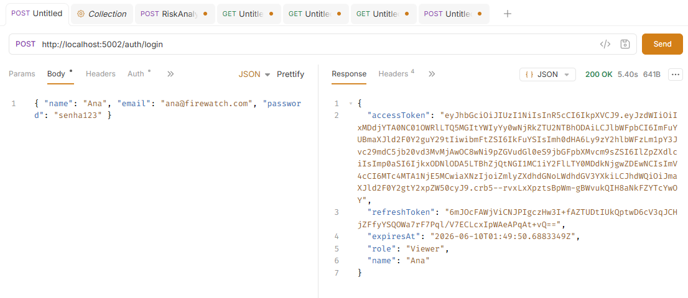
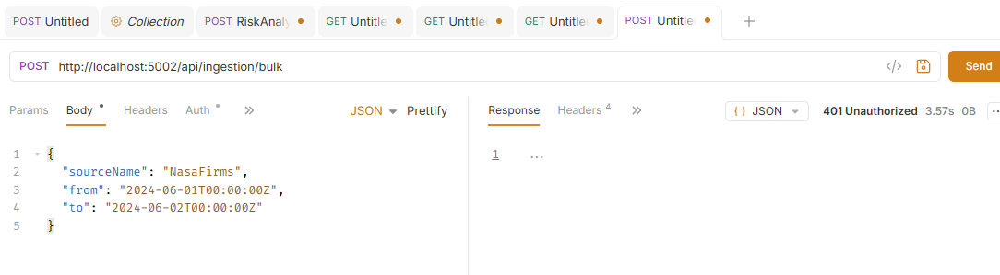
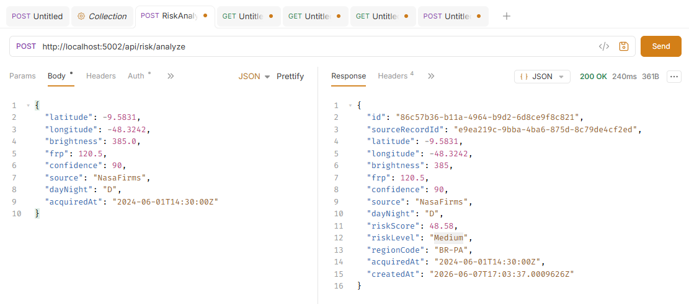
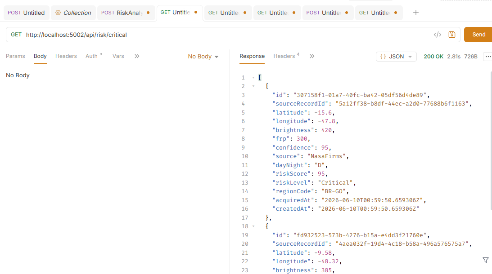
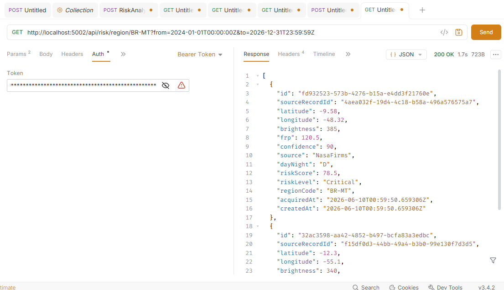
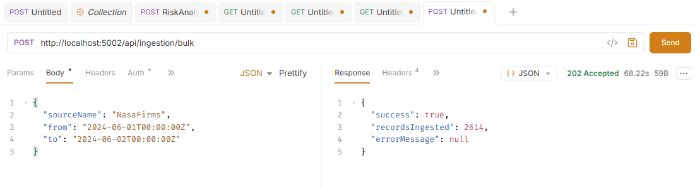
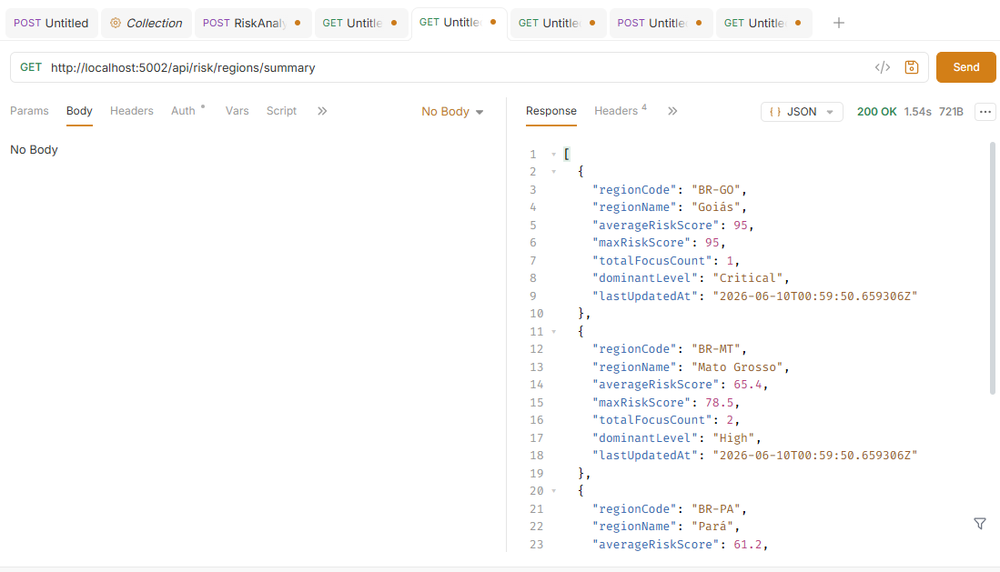

# FireWatch

Sistema distribuído para monitoramento e análise de riscos de queimadas, desenvolvido em **ASP.NET Core 8**, utilizando arquitetura orientada a eventos, **RabbitMQ** para comunicação assíncrona e **PostgreSQL** para persistência.

## Integrantes
- Ana Clara Melo - RM 559021
- David Murillo de Oliveira Soares - RM 559078
- Lucas Serrano - RM555170
- Yasmin Gonçalves Coelho - RM 559147

## Arquitetura

A solução é composta por três microsserviços principais:

| Serviço                | Porta | Responsabilidade                         |
| ---------------------- | ----- | ---------------------------------------- |
| Data Ingestion Service | 5000  | Coleta, valida e publica dados espaciais |
| Risk Analysis Service  | 5001  | Processa eventos e calcula riscos        |
| API Gateway            | 5002  | Autenticação, autorização e roteamento   |

### Tecnologias utilizadas

* .NET 8
* ASP.NET Core
* Entity Framework Core
* PostgreSQL
* RabbitMQ
* JWT Authentication
* YARP Reverse Proxy
* FluentValidation
* Swagger

### Comunicação

Os serviços se comunicam por meio do RabbitMQ utilizando o exchange:

```text
firewatch.events
```

Fluxo simplificado:

```text
Data Ingestion
      │
      ▼
 RabbitMQ
      │
      ▼
Risk Analysis
      │
      ▼
 API Gateway
      │
      ▼
 Clientes
```

## Estrutura da Solução

```text
FireWatch
│
├── FireWatch.DataIngestion
├── FireWatch.RiskAnalysis
└── FireWatch.Gateway
```

## Pré-requisitos

Antes de executar a solução, certifique-se de possuir:

* Visual Studio 2022 (17.8 ou superior)
* .NET SDK 8
* PostgreSQL 16+
* RabbitMQ 3.x

## Configuração

Atualize as strings de conexão e configurações do RabbitMQ nos arquivos:

```text
appsettings.json
```

de cada projeto.

## Executando a Solução

### 1. Abrir a solução

Abra o arquivo:

```text
FireWatch.sln
```

no Visual Studio.

### 2. Configurar múltiplos projetos de inicialização

No Visual Studio:

```text
Solution
 └─ Properties
     └─ Startup Project
```

Selecione:

```text
Multiple startup projects
```

Configure todos os projetos como:

```text
Start
```

* FireWatch.DataIngestion
* FireWatch.RiskAnalysis
* FireWatch.Gateway

### 3. Executar dependências

Garanta que os serviços abaixo estejam em execução:

* PostgreSQL
* RabbitMQ

### 4. Executar a aplicação

Pressione:

```text
F5
```

ou

```text
Ctrl + F5
```

O Visual Studio iniciará os três serviços simultaneamente.

## Swagger

Após iniciar a solução:

| Serviço        | URL                            |
| -------------- | ------------------------------ |
| Data Ingestion | https://localhost:5000/swagger |
| Risk Analysis  | https://localhost:5001/swagger |
| API Gateway    | https://localhost:5002/swagger |

## Observações da solução

* Cada serviço possui banco de dados próprio.
* A comunicação entre serviços ocorre de forma assíncrona via RabbitMQ.
* Os detalhes de implementação, endpoints e regras de negócio estão documentados nos READMEs específicos de cada projeto.


## Testes nos Endpoints | Usando Bruno API

## GET /auth/login - 200OK
Autenticação e geração de token JWT


## GET /auth/login - 401 
Acesso negado — Request sem token Bearer


## POST /api/risk/analyze - 200OK
Score calculado para um foco de calor


## GET /api/risk/critical - 200OK
Focos críticos — Alertas das últimas 24 horas


## GET /api/risk/region/BR-MT?from=2025-01-01T00:00:00Z&to=2025-12-31T23:59:59Z - 200OK
Risco por região — Assessments filtrados por estado e período


## POST /api/ingestion/bulk - 200OK
Ingestão em lote — Coleta de dados da NASA FIRMS


## /api/risk/regions/summary
Resumo por região — Agregação de risco por estado brasileiro


